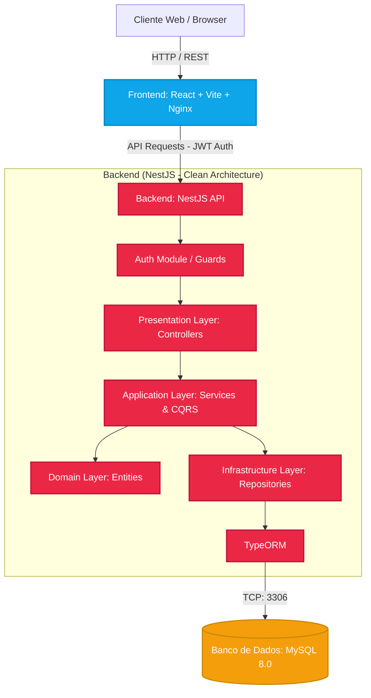

# Portal Financeiro - Corretagem White Label

Bem-vindo ao repositório do **Portal Financeiro**, uma plataforma completa de corretagem digital em formato White Label. Este projeto engloba uma arquitetura moderna e escalável dividida entre um backend robusto (NestJS) e um frontend interativo e performático (React + Vite).

---

## 🏗️ Arquitetura do Projeto

O projeto foi concebido seguindo princípios de **Domain-Driven Design (DDD)** e arquitetura em camadas para garantir manutenibilidade, separação de responsabilidades e escalabilidade.

### Fluxograma da Arquitetura

Abaixo está o diagrama ilustrando a comunicação entre os serviços e a estrutura interna da aplicação:



### **Backend (NestJS)**
A API do servidor foi desenvolvida com [NestJS](https://nestjs.com/) e TypeScript. Ela se comunica com um banco de dados **MySQL** usando o ORM **TypeORM**.
- **Camada de Apresentação (Controllers)**: Recebe requisições HTTP e valida dados usando `class-validator`.
- **Camada de Aplicação (Services / CQRS)**: Executa a lógica de negócios e orquestra o fluxo de dados. O módulo de ordens (Orders) implementa ativamente o padrão CQRS (Command Query Responsibility Segregation) separando fluxos de leitura e gravação.
- **Camada de Infraestrutura (Entities / Repositories)**: Define o esquema do banco de dados (MySQL) e isola o acesso a dados.
- **Autenticação**: Baseada em **JWT (JSON Web Tokens)** e Passport.js para controle de acesso seguro aos endpoints.
- **Seeding Automático**: O backend detecta na inicialização se o banco está vazio e automaticamente o popula com mocks iniciais de ações (Stocks), índices, carteiras de usuários e ordens.
- **Documentação da API**: Gerada automaticamente pelo Swagger. Pode ser acessada em `/api/docs`.

### **Frontend (React + Vite)**
A interface do usuário foi construída usando **React**, empacotada com **Vite** para máxima velocidade de desenvolvimento.
- **Estilização**: Tailwind CSS com suporte a Dark/Light Mode dinâmico.
- **Gerenciamento de Estado**: Zustang para configurações globais de tema e Contextos.
- **Gráficos e Dados**: Utiliza a biblioteca **Recharts** para desenhar os gráficos em tempo real da performance dos ativos (IBOV, Ações).
- **Integração com API**: Utiliza **Axios** com interceptors para injeção automática do token JWT nas requisições seguras.

---

## 🐳 Executando com Docker (Recomendado)

O projeto está totalmente conteinerizado, garantindo que rode de forma idêntica em qualquer ambiente (Produção ou Desenvolvimento). O `docker-compose.yml` raiz orquestra os 3 serviços:
1. **db**: Banco de dados MySQL 8.0.
2. **backend**: Aplicação NestJS exposta na porta `3001`.
3. **frontend**: Aplicação SPA React servida através do Nginx na porta `80`.

### Pré-requisitos
- Docker
- Docker Compose

### Passos para inicializar

Na raiz do projeto (onde se encontra o arquivo `docker-compose.yml`), execute:

```bash
docker-compose up --build -d
```

Este comando fará o build das imagens (Backend e Frontend) e iniciará os containers.

### Acessando os Serviços
- **Frontend (Interface Web)**: Acesse `http://localhost` no seu navegador.
- **Backend (API)**: Acesse `http://localhost:3001`.
- **Documentação da API (Swagger)**: Acesse `http://localhost:3001/api/docs`.

> **Nota sobre o Banco de Dados**: Na primeira vez que o backend subir com sucesso conectado ao banco de dados, o `SeederService` irá rodar automaticamente e injetar todos os dados de ações, índices e usuários. O usuário de demonstração padrão é `admin@portal.com` com senha `admin123`.

---

## 💻 Executando Localmente (Sem Docker)

Caso prefira rodar os serviços localmente para desenvolvimento:

### 1. Iniciar o Banco de Dados
Acesse a pasta do backend e inicie apenas o container do MySQL:
```bash
cd backend
docker-compose up -d
```

### 2. Iniciar o Backend
```bash
cd backend
npm install
npm run start:dev
```
O servidor estará rodando em `http://localhost:3001`.

### 3. Iniciar o Frontend
Em um novo terminal:
```bash
cd Portal-Financeiro-Corretagem-White-Label-
npm install
npm run dev
```
O frontend estará acessível em `http://localhost:5173`.

---

## 🛠️ Tecnologias Utilizadas

**Backend:**
- Node.js & NestJS
- TypeScript
- MySQL & TypeORM
- CQRS (@nestjs/cqrs)
- JWT (Passport.js)
- Swagger (OpenAPI)

**Frontend:**
- React 18 & Vite
- Tailwind CSS
- Framer Motion (Animações)
- Recharts (Gráficos Financeiros)
- Axios
- Lucide React (Ícones)
- date-fns (Manipulação de Datas)

**Infraestrutura:**
- Docker
- Docker Compose
- Nginx (Servidor Web do Frontend)

---
*Projeto desenvolvido para demonstração de arquitetura escalável e Domain-Driven Design no setor de Finanças.*
